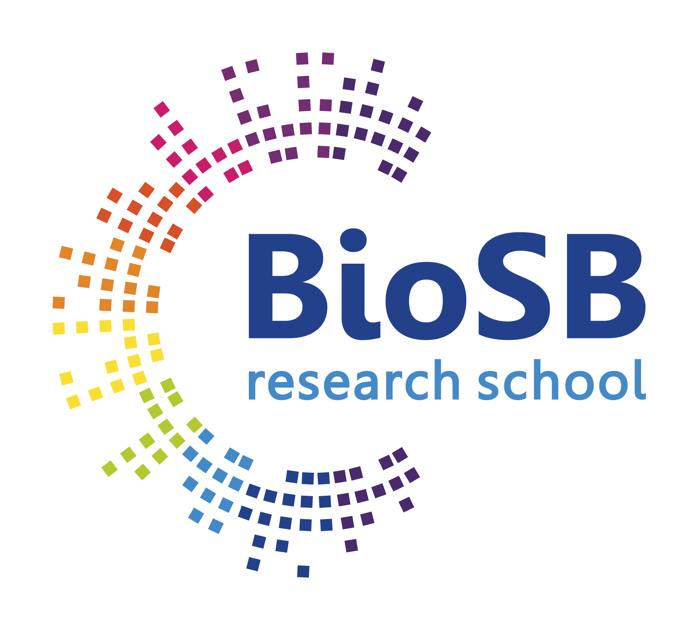

<!------>

# Machine Learning for Bioinformatics & Systems Biology

A yearly course, part of the [BioSB](https://www.biosb.nl) Research School
	
*Lecturers*
   * dr. ir. Perry Moerland (Amsterdam UMC, location: Academic Medical Center)   
   * prof. dr. ir. Marcel Reinders (Delft University of Technology)
   * prof. dr. Lodewyk Wessels (Netherlands Cancer Institute)

*Course coordinator*:
   * dr. ir. Perry Moerland
   * e-mail: p.d.moerland@amsterdamumc.nl
   * telephone: +31 20 5666945

## Learning objectives

After having followed this course, the student has a good understanding of a wide range of machine learning techniques and is able to recognize what method is most applicable to data analysis problems (s)he encounters in bioinformatics and systems biology applications.

## Target audience

The course is aimed at !PhD students with a background in bioinformatics, systems biology, computer science or a related field, and life sciences. Participants from the private sector are also welcome. A working knowledge of basic statistics and linear algebra is assumed. Preparation material on statistics and linear algebra will be distributed before the course, to be studied by students missing the required background.

## Description

Modern biology is a data-rich science, driven by our ability to measure the detailed molecular characteristics of cells, organs, and individuals at many different levels. Interpretation of these large-scale biological data requires the detection of statistical dependencies and patterns in order to establish useful models of complex biological systems. Techniques from machine learning are key in this endeavour. Typical examples are the visualization of single-cell RNA-seq data using dimensionality reduction methods, base calling for nanopore sequencing data using hidden Markov models and (recurrent) neural networks, and classification of high-throughput microscopy image data using convolutional neural networks. 

In this one-week course, the foundations of machine learning will be laid out and commonly used methods for unsupervised (clustering, dimensionality reduction, visualization) and supervised (mainly classification) learning will be explained in detail. Methods will be illustrated using recent examples from the fields of systems biology and bioinformatics. Methods discussed in the morning lectures will be put into practice during the afternoon computer lab sessions. The course has to be completed afterwards with a 5-10 page report describing the analysis of a biological dataset using some of the methods taught in the course.

## Registration

You can register for this course by filling out the BioSB [enrolment form](https://www.biosb.nl/archive-courses/machine-learning-for-bioinformatics-and-systems-biology-2020/). The maximum number of participants is 25, so register soon to be sure of a course seat! *Update: we reached the maximum number of participants for the 2020 edition. Registration is closed.* If you would like to be put on the reserve list, please send an email to [Femke Francissen](mailto:femke.francissen@biosb.nl). If you are interested in the 2021 edition of the course please fill out the [pre-registration form](https://www.biosb.nl/education/enrollment/pre-registration-courses/).

The course fee includes:

   * Course material: Lecture slides, a lab course manual and software required for the lab course (MATLAB toolboxes) will be made available online.
   <!--- * Catering: Coffee, tea, soft drinks and lunch will be provided.--->

 <!--- Information about hostel accommodation in Amsterdam can be found [[https://www.vu.nl/en/programmes/links/hotels.aspx][here]]. Accommodation is not included in the course fee.--->
 
 ## Course material

*All course material will be made available online <!--- [[MachineLearningMaterials][here]]--->* and includes the handouts of the slides, a lab course manual and the required data and Matlab toolboxes. 

For the moment you are already advised to have a look at the following documents:
   * To prepare for the course: a [self-evaluation test](background/Self-evaluation.pdf) on the prerequisite prior knowledge (probability theory and linear algebra). If you have a lot of trouble answering some of these exercises, consult the text books mentioned in the PDF, or a few [primers](background/Primers.zip) on these topics.
   * The lab courses will make extensive use of Matlab. You do not need to be a fluent programmer, but if you have never worked with Matlab before it may help to try to get a hold of a copy of Matlab (your university may have a campus license) before the course and have a look at the Appendices of the lab course [manual](manual/Manual.pdf). An extensive Matlab [primer](background/Matlab.pdf) is also available. 

During the course Matlab and all software/data are available on the PCs in the lab, so there is no need to bring your laptop.

